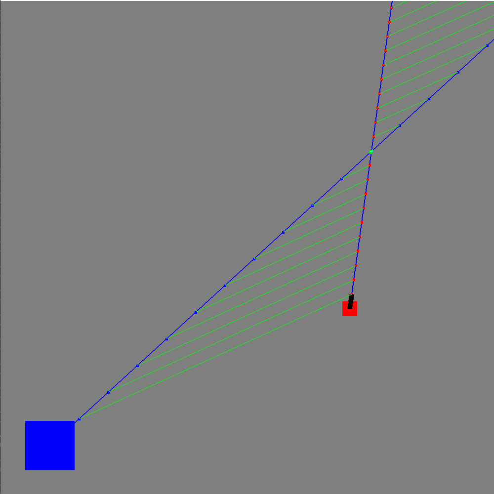
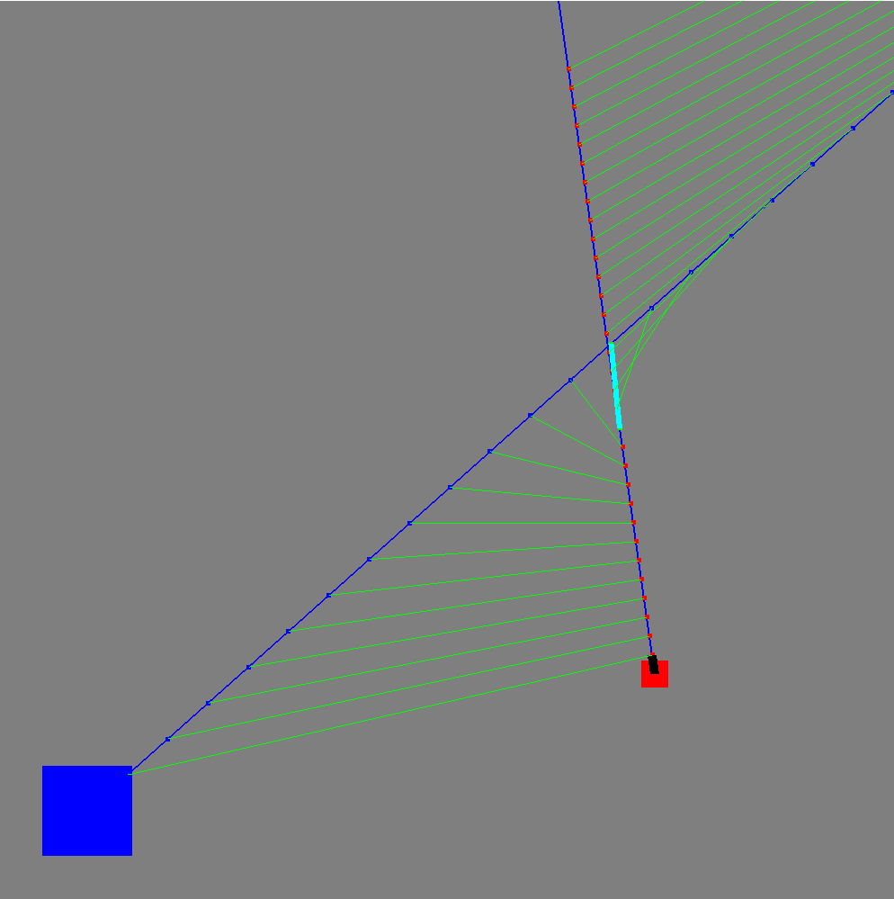

# Trajectory Simulation

## DISCLAIMER
Code implemented quickly without any optimizations, so it is a mess... but at least it's a fun toy to check the concept.

## Short Description
Simple simulation, which creates:
- player (position, velocity)
- cannon (aim vector, bullet velocity)

Code simulates N future instances of player and bullet i.e. where would they be, if they are moving every frame according to their velocity.
This way we can see, if aiming cannon in direction X will result in hitting the player.

## Shortcuts
- O - enable/disable green lines (all distances between future instances of player and bullet, except for the closest one)
- P - enable/disable blue lines (indication of movement direction) and all future instances of player and bullet, except for the closest pair
- K - increase speed of bullet
- J - decrease speed of bullet
- M - increase the number of points (future instances)
- N - decrease the number of points
- S - set the position of player to cursor
- D - set the player's velocity to vector player->cursor

## Examples

